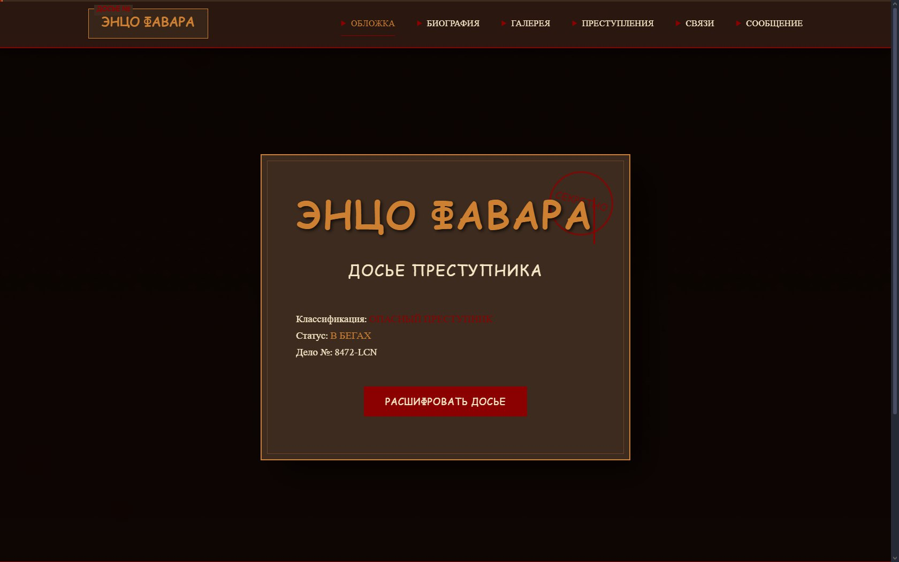
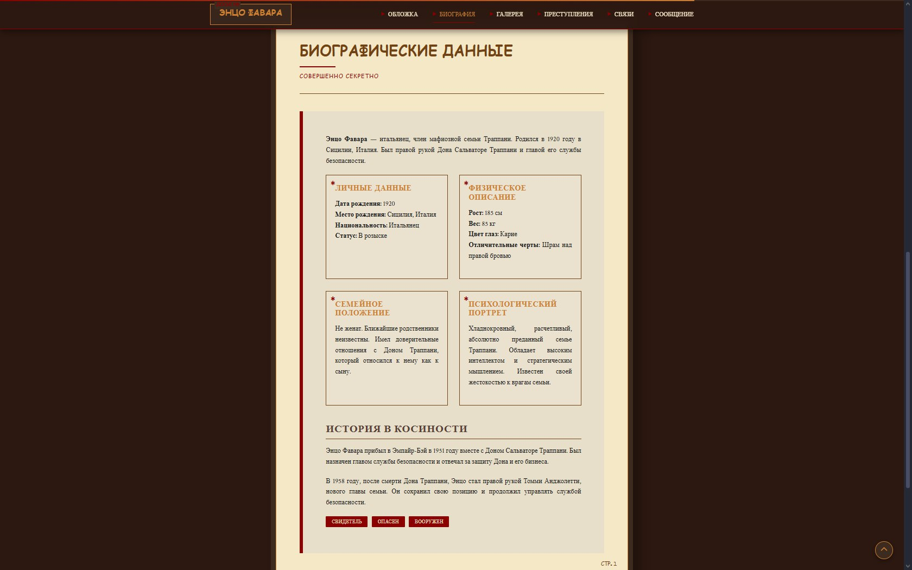
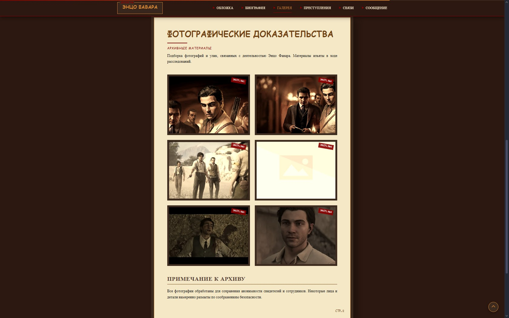
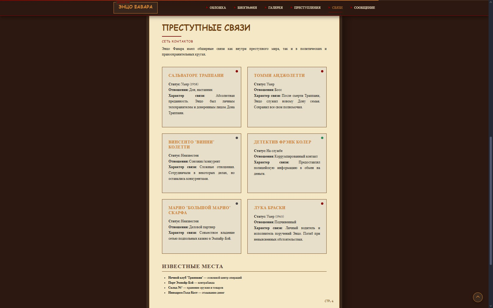

# 🎨 Сайт-визитка Энцо Фавара

Одностраничный сайт-визитка для Энцо Фавара, созданный в рамках учебной практики. Адаптивный дизайн, интерактивные элементы, форма обратной связи.

## 📸 Скриншоты
<div align="center">
  
 
                      Вкладка "Домашняя страница"

                      Вкладка "Биографические данные"

                  Вкладка "Фотографические докозательства"


                Вкладка "Хронология преступления"

Вкладка "Преступная связь"

                    Вкладка "Обратная связь"
                    </div>
## 🚀 Живая демо
**[👉 Открыть сайт на GitHub Pages](https://Lilomii1.github.io/Enzo-Favara/)**

## 🛠 Технологии
- HTML5 (семантическая верстка)
- CSS3 (Flexbox, Grid, анимации)
- JavaScript (Vanilla)
- Git & GitHub
- Formspree (для формы обратной связи)
- Figma (для прототипирования)

## ✨ Функциональность
- ✅ Адаптивный дизайн (мобильные устройства, планшеты, ПК)
- ✅ Интерактивная биография с таймлайном
- ✅ Галерея работ/проектов
- ✅ Рабочая форма обратной связи
- ✅ Плавные CSS-переходы и hover-эффекты
- ✅ Секция с профессиональными навыками

## ⚙️ Установка и запуск локально

### Способ 1: Через Git
```bash
git clone https://github.com/Lilomii1/Enzo-Favara.git
cd Enzo-Favara
# Откройте index.html в браузере
